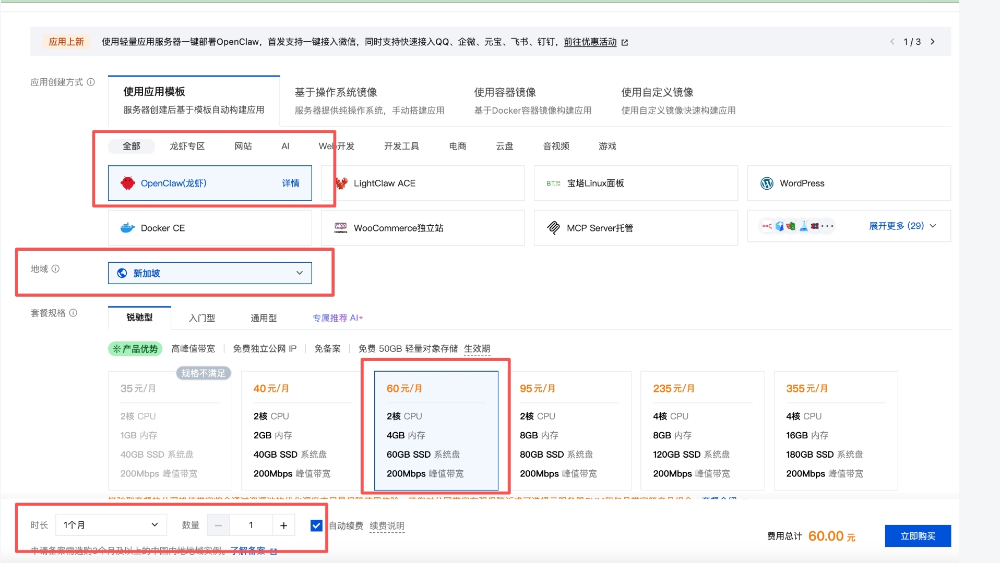
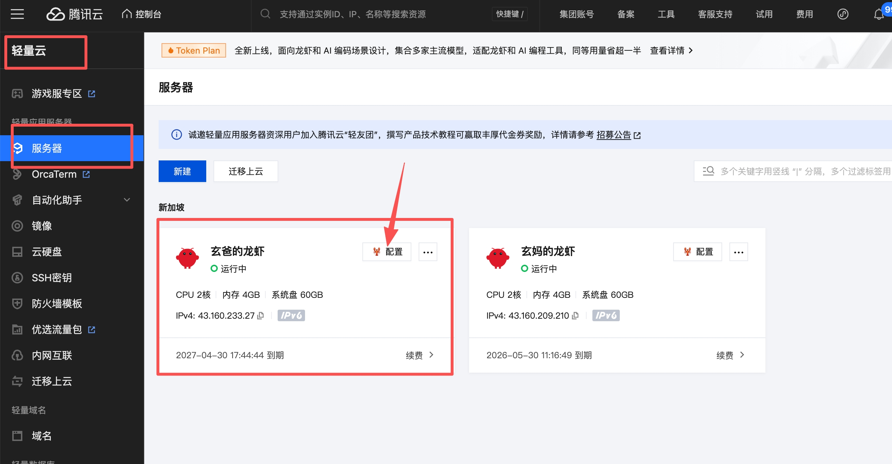

# 第一章：选购腾讯云服务器

**目标：拥有自己的公网服务器，24小时运行 OpenClaw**

---

## 1. 为什么需要云服务器？

用自己的电脑跑 OpenClaw 可以，但需要：
- 电脑 24 小时开机
- 家庭宽带有公网 IP
- 断网 Bot 就离线

云服务器：**99.9% 在线、自带公网 IP、月租几十元**。

推荐配置：
- **地域**：新加坡（访问 GitHub 更流畅）
- **系统**：Ubuntu 22.04 LTS
- **规格**：2核2G
- **带宽**：5Mbps
- **存储**：50GB SSD

---

## 2. 购买流程

1. 打开 [腾讯云轻量应用服务器](https://cloud.tencent.com/product/lighthouse)
2. 选择配置（如上）
3. 设置登录密码（**记住！**）
4. 购买

记录好服务器 IP、用户名（ubuntu）、密码。

付费完成后，可在控制台看到实例信息：

---

## ✅ 本章小结

- ✅ 购买了云服务器（新加坡节点）

---

## ➡️ 下一步

[第二章：选购大模型](./02-选购大模型.md)
