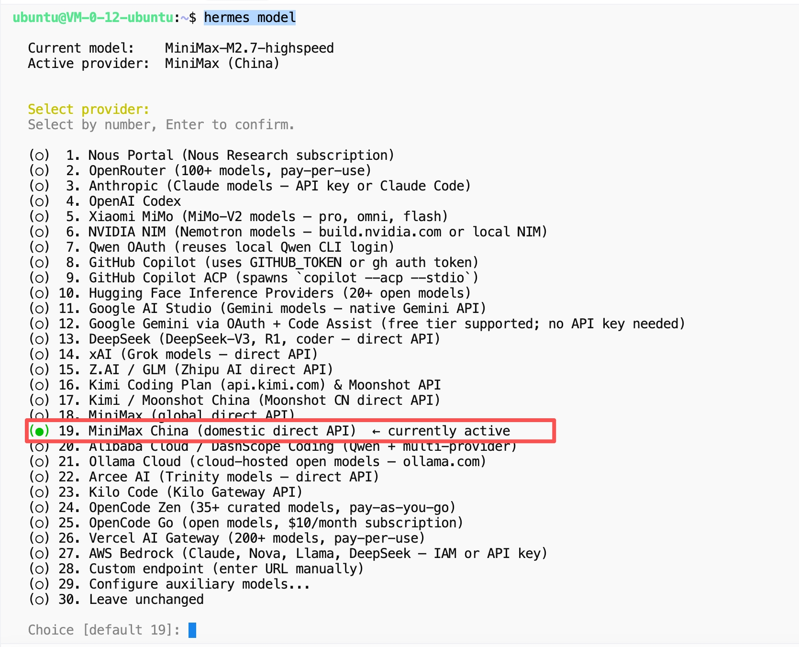

# 第二章：选购大模型

**目标：获取 AI 模型 API Key，让 Agent 具备智能**

***

## 1. 主流模型对比

| 模型           | 优势           | 劣势        | 推荐场景   |
| ------------ | ------------ | --------- | ------ |
| **MiniMax**  | 中文好、价格便宜、响应快 | 生态相对新     | ✅ 国内首选 |
| **DeepSeek** | 性价比高、开源      | 品牌认知度还在建立 | 追求性价比  |
| **Claude**   | 英文能力强        | 国内访问稍慢    | 英文场景   |
| **GPT-4**    | 通用能力强        | 成本高       | 预算充足   |

**推荐：MiniMax**（中文优化好 + 价格实惠 + Hermes 原生支持）

> 💡 **觉得 AI 助手很弱智？大概率是大模型没选对！**
> 免费模型（如 DeepSeek 免费版）能力有限，回复慢、内容浅。想要真正智能的体验，推荐使用 **MiniMax Plus/Max 付费套餐**，响应快、内容深、真正发挥 Hermes 的价值。

***

## 2. 注册 MiniMax（邀请码享 9 折优惠）

> 🎁 **MiniMax 跨年福利来袭！邀好友享 Token Plan 双重好礼，助力开发体验！** 好友立享 **9折** 专属优惠 + Builder 权益，你赢返利 + 社区特权！ 👉 立即参与：[https://platform.minimaxi.com/subscribe/token-plan](https://platform.minimaxi.com/subscribe/token-plan)

点击上方邀请链接 → 手机号注册 → 完成实名认证 → 享 9 折优惠！

***

## 3. 购买 Token Plan 服务

推荐购买 **Plus-极速版**，包年更划算（推荐包年）：


### Plus-极速版 套餐亮点

**🎯 量大管饱，无 token 焦虑！**

| 套餐           | 用量              | 价格                |
| ------------ | --------------- | ----------------- |
| **Plus-极速版** | 1500次模型调用 / 5小时 | ￥1,791/年（立省 ￥597） |
| **Max-极速版**  | 4500次模型调用 / 5小时 | 更大量               |

**Plus-极速版核心能力：**

* 1500次模型调用 / 5 小时
* 支持最新 MiniMax-M2.7-highspeed，约 100 TPS 极速推理
* 同类产品 3 倍生成速度
* 约支持 1~2 个 Hermes agent
* 支持图像理解、联网搜索 MCP
* 生成图像和语音
* **每周可使用额度为「每5小时额度」的 10 倍**（即每周最多 15000 次）

购买完成后，进入 **「我的账户」→「账户设置」** 获取你的 API Key。

***

## 4. 配置 Hermes 使用模型

编辑 `~/.hermes{N}/config.yaml`，配置模型：

```yaml
model:
  default: MiniMax-M2.7
  provider: minimax-cn
  base_url: https://api.minimaxi.com/anthropic
```

同时在 `~/.hermes{N}/.env` 中配置 API Key：

```bash
MINIMAX_CN_API_KEY=***
```



***

## 5. 验证配置

启动 Agent 后，在飞书对话框输入：

> 你现在用的是什么大模型

回复显示 **MiniMax M2.7**，说明配置成功！

***

## ✅ 本章小结

* ✅ 了解了主流模型
* ✅ 注册了 MiniMax（邀请码享 9 折）
* ✅ 购买了 Plus-极速版 Token Plan
* ✅ 获取了 API Key 并配置 Hermes

***

## ➡️ 下一步

[第三章：接入飞书](03-接入飞书-HERMES.md)
