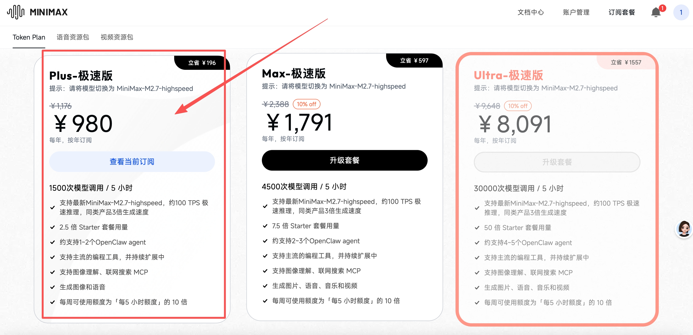

# 第二章：选购大模型

**目标：获取 AI 模型 API Key，让 Agent 具备智能**

---

## 1. 主流模型对比

| 模型 | 优势 | 劣势 | 推荐场景 |
|------|------|------|----------|
| **MiniMax** | 中文好、价格便宜、响应快 | 生态相对新 | ✅ 国内首选 |
| **DeepSeek** | 性价比高、开源 | 品牌认知度还在建立 | 追求性价比 |
| **Claude** | 英文能力强 | 国内访问稍慢 | 英文场景 |
| **GPT-4** | 通用能力强 | 成本高 | 预算充足 |

**推荐：MiniMax**（中文优化好 + 价格实惠 + OpenClaw 原生支持）

---

## 2. 注册 MiniMax（邀请码享 9 折优惠）

> 🎁 **MiniMax 跨年福利来袭！邀好友享 Token Plan 双重好礼，助力开发体验！**
> 好友立享 **9折** 专属优惠 + Builder 权益，你赢返利 + 社区特权！
> 👉 立即参与：[https://platform.minimaxi.com/subscribe/token-plan?code=8zcitRN5uG&source=link](https://platform.minimaxi.com/subscribe/token-plan?code=8zcitRN5uG&source=link)

点击上方邀请链接 → 手机号注册 → 完成实名认证 → 享 9 折优惠！

---

## 3. 购买 Token Plan 服务

推荐购买 **Plus-极速版**，包年更划算（推荐包年）：



### Plus-极速版 套餐亮点

**🎯 量大管饱，无 token 焦虑！**

| 套餐 | 用量 | 价格 |
|------|------|------|
| **Plus-极速版** | 1500次模型调用 / 5小时 | ￥1,791/年（立省 ￥597） |
| **Max-极速版** | 4500次模型调用 / 5小时 | 更大量 |

**Plus-极速版核心能力：**
- 1500次模型调用 / 5 小时
- 支持最新 MiniMax-M2.7-highspeed，约 100 TPS 极速推理
- 同类产品 3 倍生成速度
- 约支持 1~2 个 OpenClaw agent
- 支持图像理解、联网搜索 MCP
- 生成图像和语音
- **每周可使用额度为「每5小时额度」的 10 倍**（即每周最多 15000 次）

购买完成后，进入 **「我的账户」→「账户设置」** 获取你的 API Key。

---

## 4. 配置 OpenClaw 使用模型

编辑配置：
```bash
nano ~/.openclaw/config.yaml
```

填入：
```yaml
providers:
  minimax:
    api_key: "你的API Key"
    model: "MiniMax-M2"

default_provider: minimax
```

保存（Ctrl+X → Y → Enter）。

---

## 5. 验证配置

```bash
openclaw gateway restart
openclaw chat
```

能正常回复即配置成功。

---

## ✅ 本章小结

- ✅ 了解了主流模型
- ✅ 注册了 MiniMax（邀请码享 9 折）
- ✅ 购买了 Plus-极速版 Token Plan
- ✅ 获取了 API Key 并配置 OpenClaw

---

## ➡️ 下一步

[第三章：接入飞书](./03-接入飞书.md)
