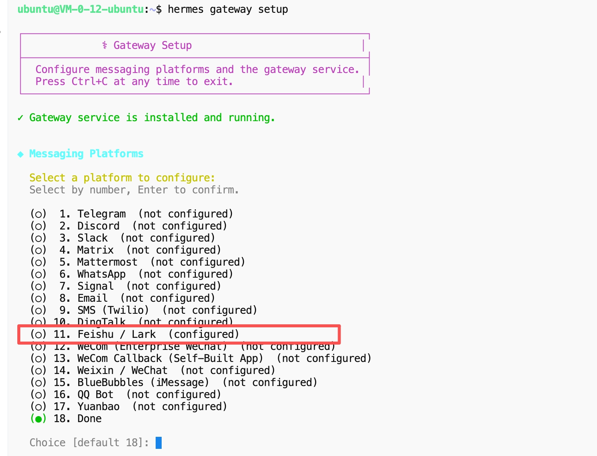
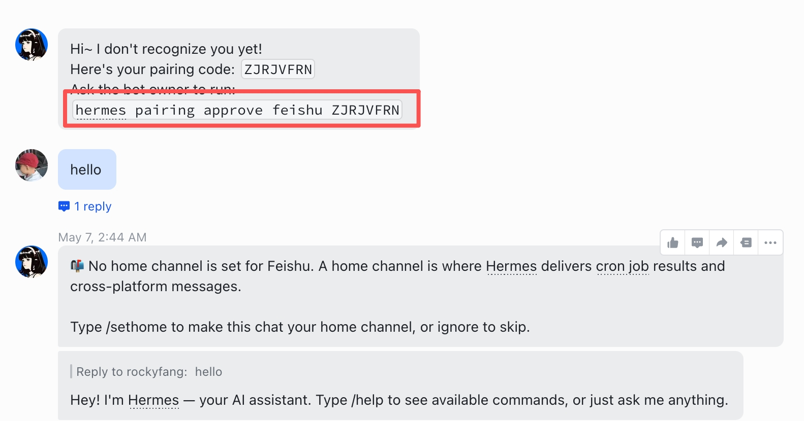

# 第三章：接入飞书

**目标：在飞书中与 Hermes Agent 对话，随时随地唤醒 AI**

***

## 1. 扫码创建飞书应用

输入命令：`hermes gateway setup`

用飞书扫描二维码，自动授权创建飞书应用。



和飞书机器人对话，如下图：



然后根据提示，在控制台输入配对码命令：

```bash
hermes pairing approve feishu ZJRJVFRN
```

然后就能正常对话聊天。

***

## ✅ 本章小结

* ✅ 执行 `hermes gateway setup` 扫码创建飞书应用
* ✅ 与飞书机器人对话获取配对码
* ✅ 执行 `hermes pairing approve feishu <配对码>` 完成配对
* ✅ 开始与 Hermes 对话

***

## ➡️ 下一步

[第四章：创建 Agent 实例](04-创建Agent-HERMES.md)
