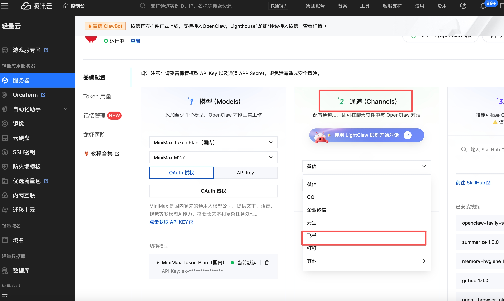
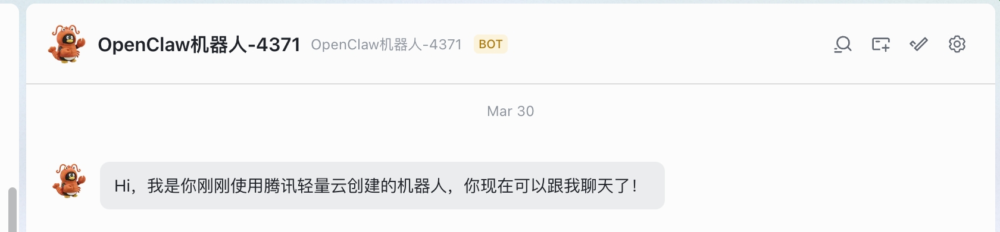

# 第三章：接入飞书

**目标：在飞书中与龙虾机器人对话，随时随地唤醒 AI**

---

## 1. 授权接入飞书

在腾讯云 OpenClaw 配置页面，点击左侧「通道」（Channels），选择 **飞书** 进行授权接入：

---

## 2. 创建飞书账号（如无账号）

没有飞书账号？可以直接创建账号，系统会自动绑定到飞书。

---

## 3. 开始在飞书中对话

绑定完成后，打开飞书 App，找到对应的 **龙虾机器人**，即可开始对话：

---

## ✅ 本章小结

- ✅ 授权接入飞书
- ✅ 开始在飞书中与龙虾机器人对话

---

## ➡️ 下一步

[第四章：创建定时任务](./04-创建定时任务.md)
