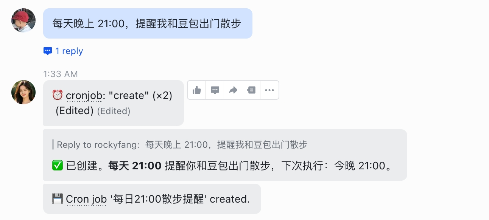

# 第四章：创建定时任务

**目标：让 Hermes Agent 按时提醒你做事**

***

## 最简单的方式

直接跟 Agent 说：**几点提醒我做什么事**，即可创建一个定时任务。

例如：每天晚上 21:00，提醒你锻炼身体。

***

## ✅ 本章小结

* ✅ 学会了最简方式：告诉 Agent「几点提醒我做什么」

***

## ➡️ 下一步

[第五章：创建 Skill](05-创建Skill-HERMES.md)
