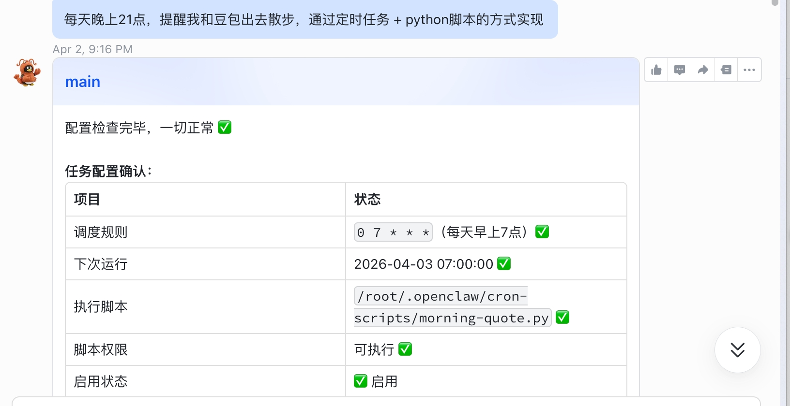

# 第四章：创建定时任务

**目标：让龙虾机器人按时提醒你做事**

***

## 最简单的方式

直接跟龙虾机器人说：**几点提醒我做什么事**，即可创建一个定时任务。

例如：每天晚上 21:00，提醒你和豆包出去散步。

***

## 推荐方案：本地 Cron + Python

使用**系统本地定时任务 + Python 脚本**的方式实现，成功率更高、更稳定。

> 龙虾内置的定时任务偶尔会失败，本地 cron + python 几乎不会失败。

***

## 提醒效果

***

## ✅ 本章小结

* ✅ 学会了最简方式：告诉龙虾机器人「几点提醒我做什么」
* ✅ 了解了稳定的实现方案：本地 Cron + Python

***

## ➡️ 下一步

[第五章：创建 Skill](05-创建Skill.md)
