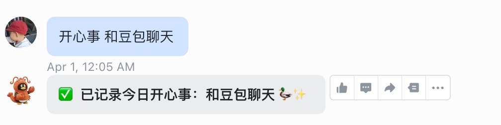

# 第五章：创建 Skill

**目标：打造属于你自己的 AI 能力扩展**

***

## 1. Skill 是什么？

Skill = Agent 的能力扩展包。

类比：手机 App。OpenClaw 是手机，Skill 就是各种 App（天气、邮件、日历...）。

***

## 2. 创建一个简单的 Skill

这里创建一个「**每日开心事**」Skill：

### 触发词

`每日开心事` + 你的开心事内容

例如：`每日开心事 散步`

### 效果

将开心事按月份保存，例如 `/root/my-happy/2026-03.md`，格式如下：

```markdown
日期：2026-03-05
- 开心事1
- 开心事2
```

### 使用方法

跟龙虾机器人说：**每日开心事 xxxx**



***

## 3. 高级进阶

可以试着让龙虾配置 SSH，让龙虾能将本地记录自动提交到 GitHub。

例如：每天的开心事自动同步到 GitHub 仓库，形成持久化的个人记录。

***

## ✅ 本章小结

* ✅ 理解了 Skill 是什么
* ✅ 学会了创建「每日开心事」Skill
* ✅ 了解了进阶方向：自动同步 GitHub

***

## ➡️ 下一步

[第六章：配置多 Agent](06-配置多Agent.md)
