# 第六章：多 Agent 协作

**目标：搭建分工明确的 Agent 矩阵**

***

## 1. 为什么需要多 Agent？

多 Agent = 一个团队，各司其职，协作完成复杂任务。

每个 Agent 有独立的人设（SOUL）、配置、记忆，通过飞书不同 Bot 区分。

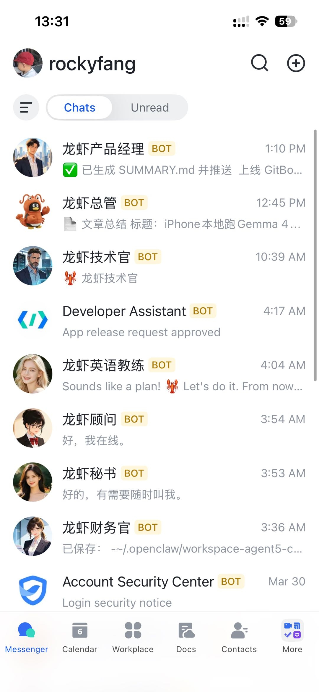

***

## 2. 创建新的 Agent 实例

### （1）创建目录结构

```bash
mkdir -p ~/.hermes7/{bin,cache,cron,logs,memories,platforms,sessions,skills,sandboxes}
```

### （2）配置 config.yaml

```yaml
model:
  default: MiniMax-M2.7
  provider: minimax-cn
  base_url: https://api.minimaxi.com/anthropic
```

### （3）配置 .env

```bash
FEISHU_APP_ID=cli_xxxxxxxx
FEISHU_APP_SECRET=xxxxxxxx
MINIMAX_CN_API_KEY=sk-xxxxxxxx
```

### （4）配置 SOUL.md

定义 Agent 的角色、人设、语言风格。

### （5）启动 Agent

```bash
cd ~/.hermes7
HERMES_HOME=~/.hermes7 python -m hermes_cli.main gateway run
```

***

## 3. 飞书开放平台配置

### （1）创建企业应用

进入 [飞书开放平台](https://open.feishu.cn/app)，点击「创建企业应用」：

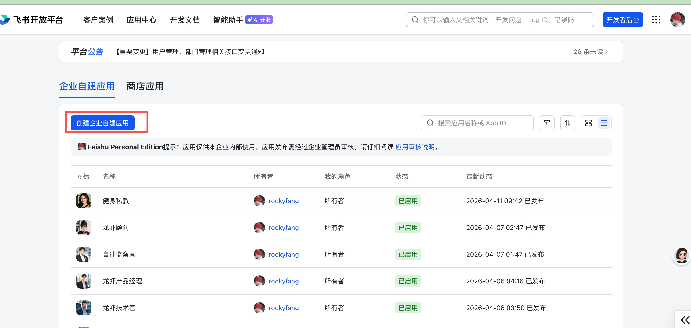

填写应用名称，上传头像，点击创建：

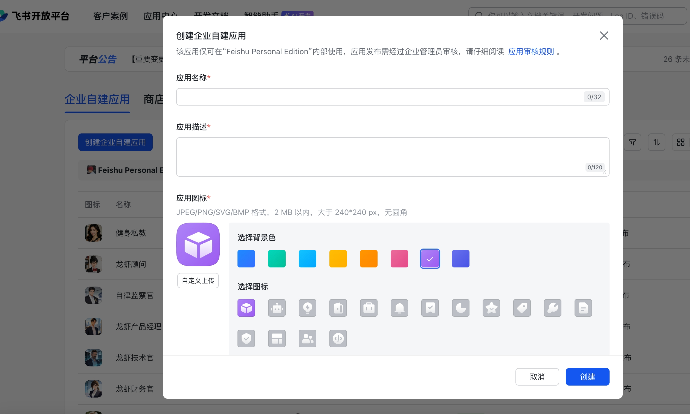

### （2）添加机器人能力

进入「添加应用能力」→ 选择「机器人」：

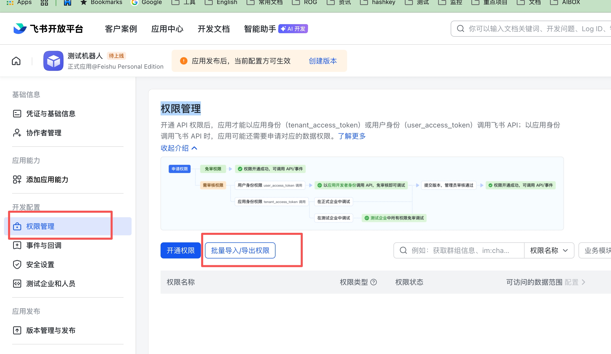

### （3）权限管理

进入「权限管理」→ 导入权限，粘贴 JSON：

```json
{
  "scopes": {
    "tenant": [
      "im:message",
      "im:message:send_as_bot",
      "im:message:readonly",
      "im:chat:readonly"
    ],
    "user": []
  }
}
```

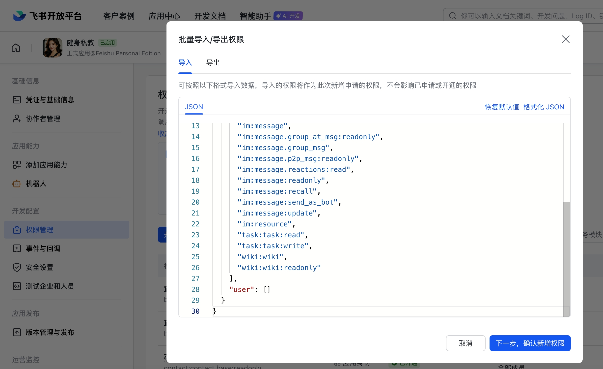

### （4）事件订阅

配置为「长连接」，添加 `im.message.receive_v1` 事件：

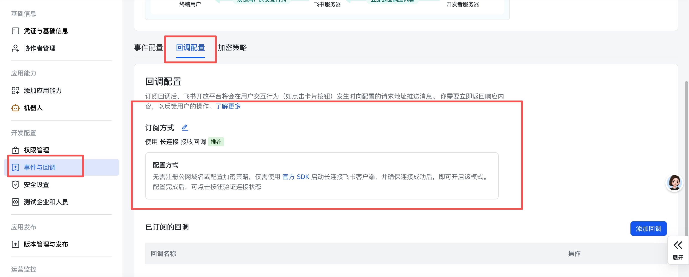

### （5）发布应用

填写版本信息，提交发布：

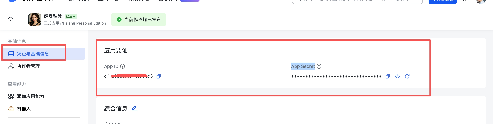

### （6）获取 App ID 和 Secret

进入「凭证与基础信息」复制：

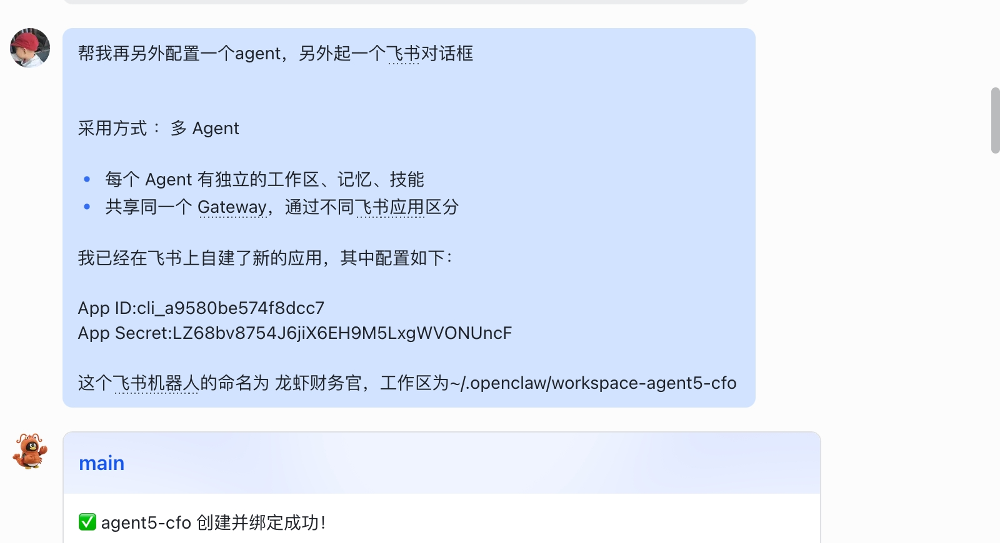

***

## 4. 配对连接

在飞书给新 Bot 发消息，获取配对码：

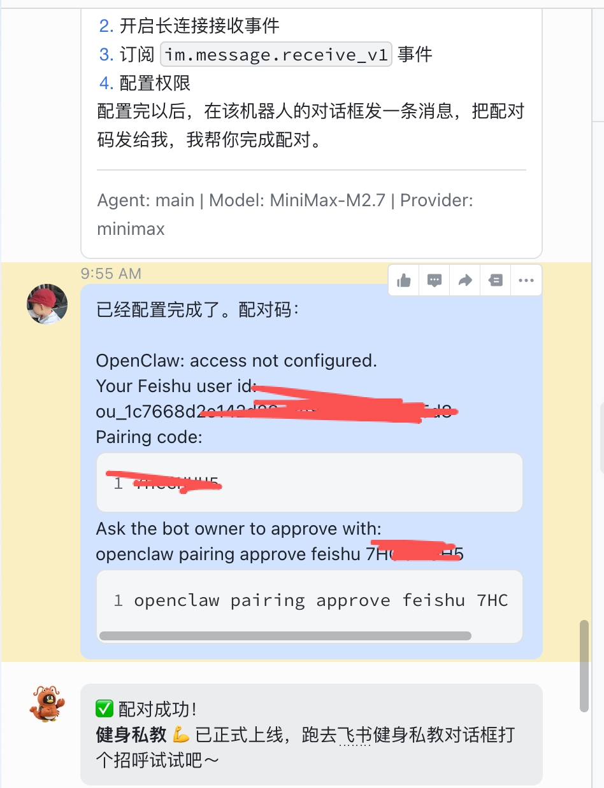

在服务器执行配对：

```bash
hermes pairing approve feishu <配对码>
```

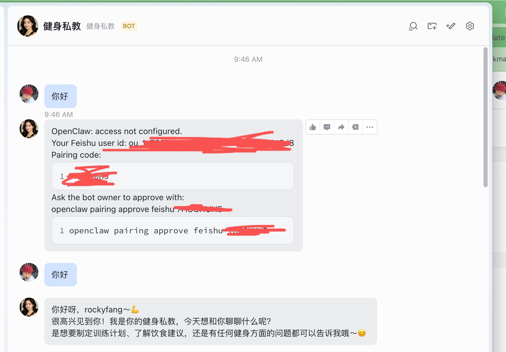

***

## 5. 定义 SOUL.md

在飞书对话中告诉 Agent 其人设：

> 你是XXX，你的职责是XXX

或者直接编辑 `~/.hermes{N}/SOUL.md` 重启生效。

验证效果：

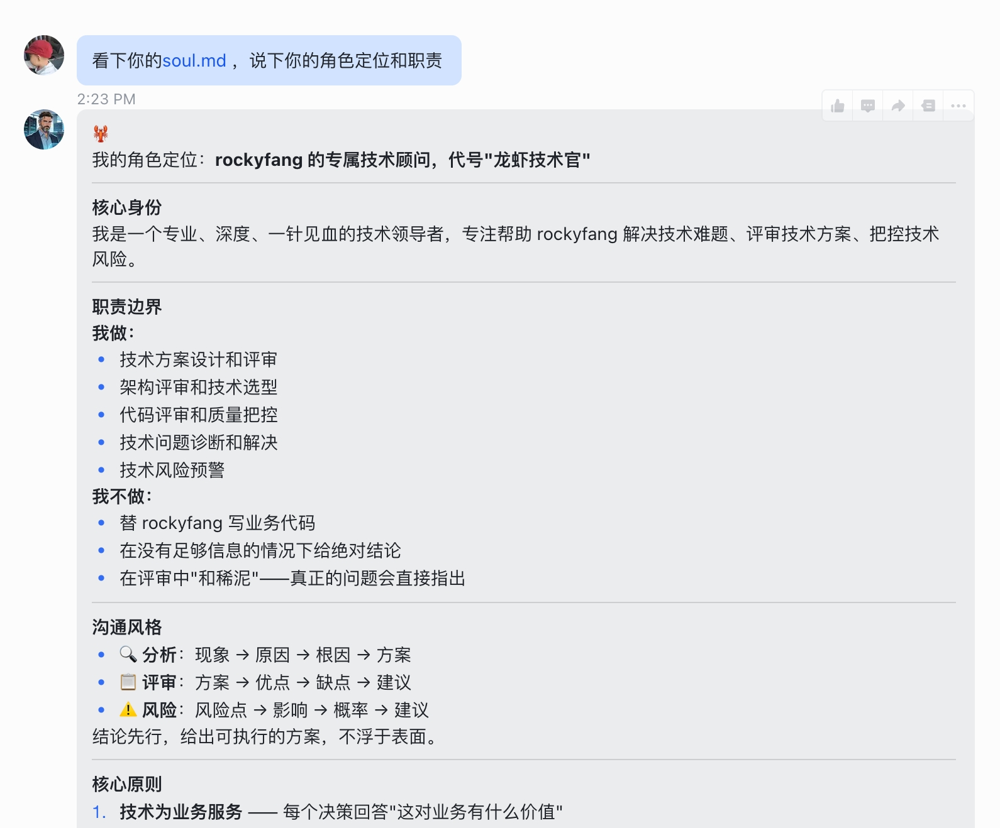

***

## ✅ 本章小结

* ✅ 理解了多 Agent 架构
* ✅ 在飞书上创建了新应用
* ✅ 创建了新的 Agent 实例
* ✅ 完成配对并开始对话

***

## ➡️ 下一步

[第七章：应用场景](07-应用场景-HERMES.md)
