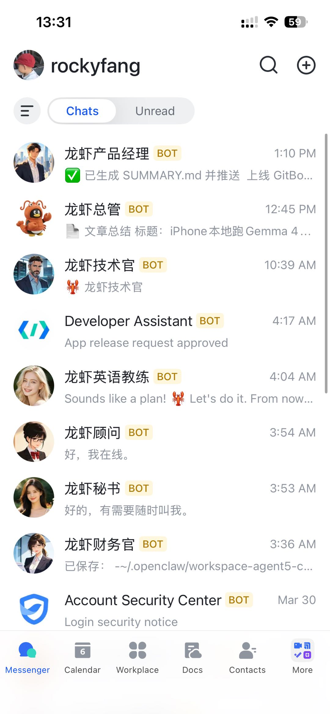

# 第六章：配置多 Agent

**目标：搭建多角色协作的 Agent 矩阵**

---

## 1. 为什么需要多 Agent？

| 方案 | 适用场景 |
|------|----------|
| 单 Agent | 日常对话，通用能力 |
| 多 Agent | 专业分工（顾问+执行+财务+技术...） |

多 Agent = 一个团队，各司其职，协作完成复杂任务。

---

## 2. 创建多个 Agent

```bash
openclaw agent create \
  --name "顾问" \
  --id agent-consultant \
  --model minimax
```

每个 Agent 有独立目录：
```
~/.openclaw/agents/
├── agent-001/           # 主 Agent
│   ├── SOUL.md
│   └── memory/
└── agent-consultant/    # 第二个 Agent
    ├── SOUL.md
    └── memory/
```

---

## 3. 定义 Agent 角色

通过 `SOUL.md` 定义每个 Agent 的职责：

```bash
nano ~/.openclaw/agents/agent-consultant/SOUL.md
```

```markdown
# 龙虾顾问

## 角色定位
用户的战略顾问，通过苏格拉底式提问引导深度思考。

## 输出标准
- 结论先行
- 言简意赅
- 主动预判
```

---

## 4. 实战：七核 Agent 矩阵

```
龙虾团队（CEO：rockyfang）
├── main            # 总管（通用助手）
├── xh              # CEO 顾问&教练（苏格拉底提问法）
├── agent3          # CEO 首席执行秘书
├── english-coach   # 英语教练（全程英语）
├── cfo             # 财务官（稳健理财）
├── cto             # 技术官（Java/Golang/加密货币）
└── pm              # 产品经理（需求落地桥梁）
```

### 七核分工

| Agent | 核心价值 | 触发场景 |
|-------|----------|----------|
| main | 通用能力兜底 | 日常对话 |
| xh | 深度思考引导 | 需要分析问题时 |
| agent3 | 执行效率 | 需要安排任务时 |
| english-coach | 英语练习 | 练英语时 |
| cfo | 财务建议 | 理财、投资相关 |
| cto | 技术方案 | 技术问题、架构设计 |
| pm | 项目统筹 | 需求拆解、任务管理 |

### 实际运行效果



> 图：七核 Agent 同时在飞书运行，各司其职

---

## 5. 扩展思路

从七核出发，按需扩展：
- `hr-agent` — 人力资源
- `sales-agent` — 销售客服
- `dev-agent` — 研发助手

---

## ✅ 本章小结

- ✅ 理解了多 Agent 架构
- ✅ 学会了创建和配置多个 Agent
- ✅ 掌握了角色定义方法
- ✅ 看到了七核实战架构

---

## 🎉 教程完结！

现在你已经掌握了 OpenClaw 的核心能力：
- ✅ 选购服务器
- ✅ 配置大模型
- ✅ 接入飞书
- ✅ 创建定时任务
- ✅ 开发自定义 Skill
- ✅ 配置多 Agent

如果觉得有帮助，欢迎打赏支持作者继续创作！

| 微信 | 支付宝 |
|------|--------|
|  |  |
