# 第六章：配置多 Agent

**目标：搭建多角色协作的 Agent 矩阵**

***

## 1. 为什么需要多 Agent？

多 Agent = 一个团队，各司其职，协作完成复杂任务。


***

## 2. 飞书新增 Agent 机器人应用

### （1）创建企业应用

进入 [飞书开放平台](https://open.feishu.cn/app)，点击「创建企业应用」：

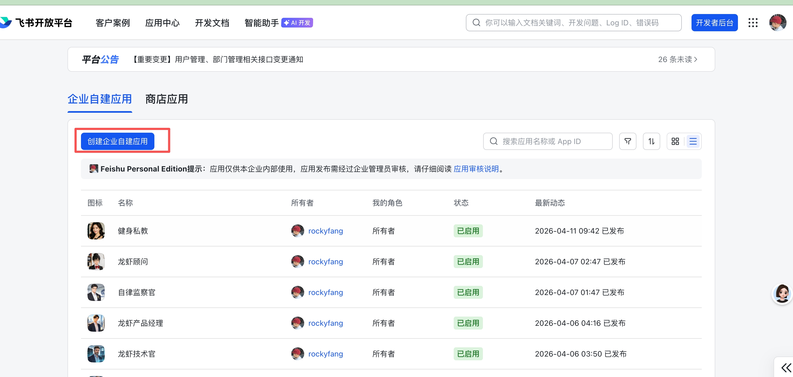

填写应用名称、应用描述，可上传头像，点击创建：

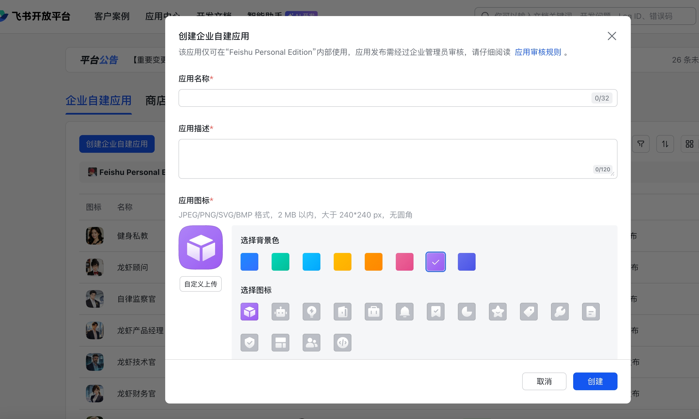

***

### （2）添加应用能力——机器人

进入应用详情，点击「添加应用能力」→ 选择「机器人」：

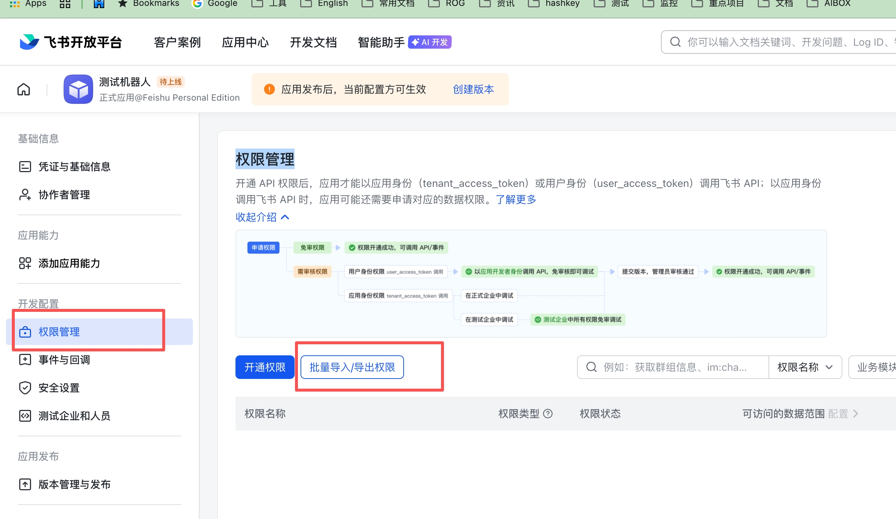

***

### （3）权限管理

进入「权限管理」→ 导入权限：

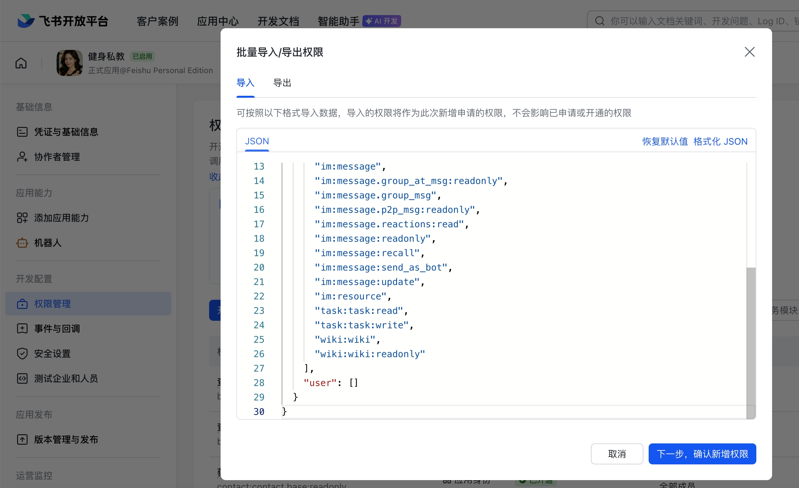

粘贴以下 JSON 内容：

```json
{
  "scopes": {
    "tenant": [
      "bitable:app",
      "bitable:app:readonly",
      "contact:contact.base:readonly",
      "contact:user.base:readonly",
      "docx:document",
      "docx:document.block:convert",
      "docx:document:readonly",
      "drive:drive",
      "drive:drive:readonly",
      "im:message",
      "im:message.group_at_msg:readonly",
      "im:message.group_msg",
      "im:message.p2p_msg:readonly",
      "im:message.reactions:read",
      "im:message:readonly",
      "im:message:recall",
      "im:message:send_as_bot",
      "im:message:update",
      "im:resource",
      "task:task:read",
      "task:task:write",
      "wiki:wiki",
      "wiki:wiki:readonly"
    ],
    "user": []
  }
}
```

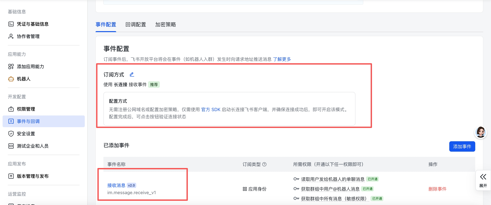

***

### （4）配置事件与回调

将订阅方式配置为「长连接」，并添加「接收消息」事件配置：

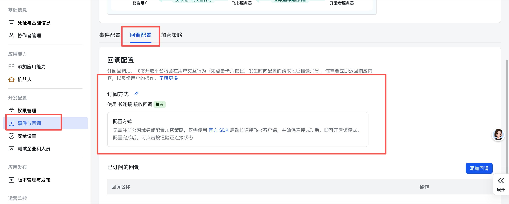 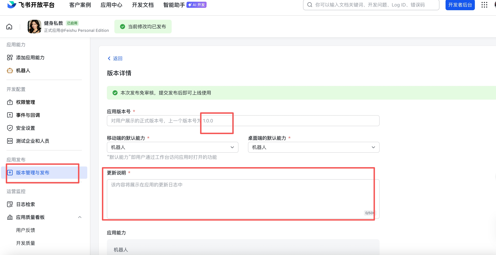

***

### （5）版本管理与发布

填写版本信息（随便填，只要能审核通过即可），完成后发布：

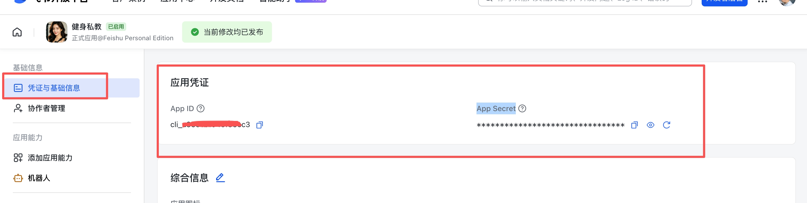

***

### （6）获取 App ID 和 App Secret

进入「凭证与基础信息」，复制 App ID 和 App Secret备用：

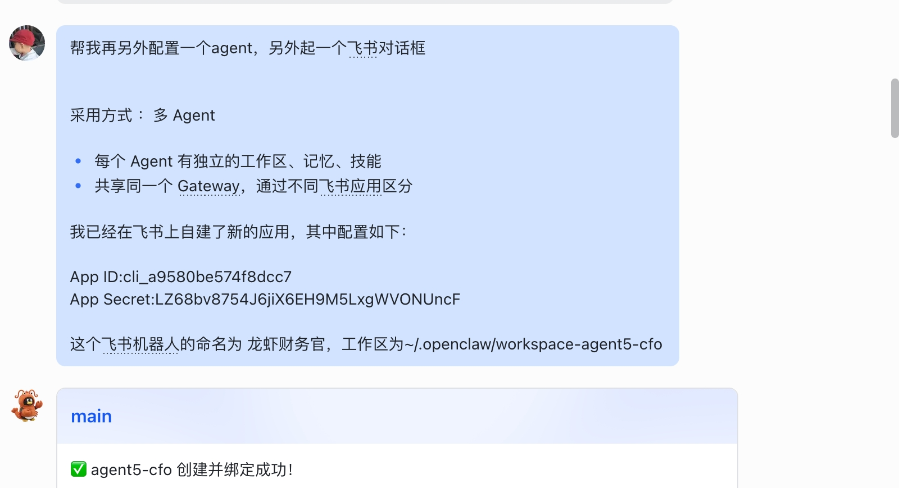

***

## 3. 让 OpenClaw 创建 Agent

将以下提示词发给主龙虾机器人，让它帮你创建新的 Agent：

> 帮我再另外配置一个 agent，另外起一个飞书对话框
>
> 采用方式：多 Agent 每个 Agent 有独立的工作区、记忆、技能 共享同一个 Gateway，通过不同飞书应用区分
>
> 我已经在飞书上自建了新的应用，其中配置如下： App ID: xxxxx（填你的 AppID） App Secret: xxxxxxx（填你的 App Secret） 这个飞书机器人的命名为「龙虾财务官」（自己定义） 工作区为 \~/.openclaw/workspace-agent5-cfo（自己定义）

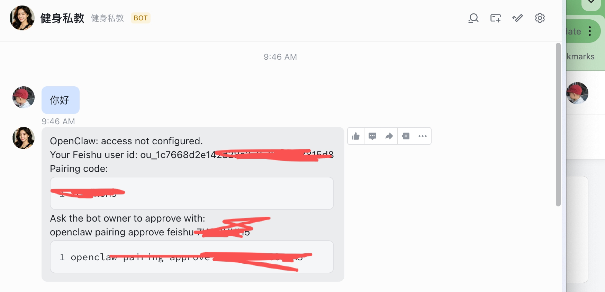

然后和新建的机器人聊天，拿到配对码：

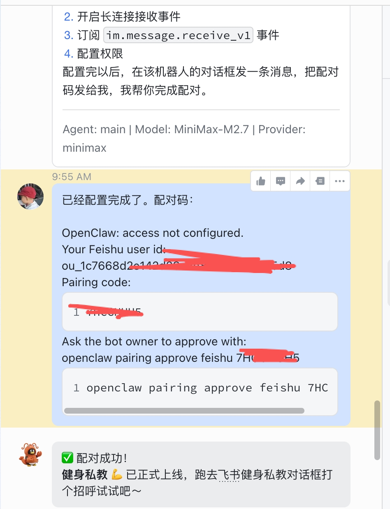

把配对码发给你的主龙虾，配对完成：

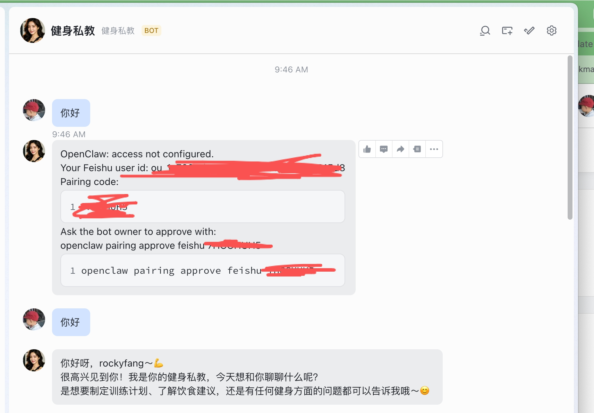

***

## 4. 定义 Agent 的 SOUL.md

在豆包上，根据你的需求生成对应的 SOUL.md：

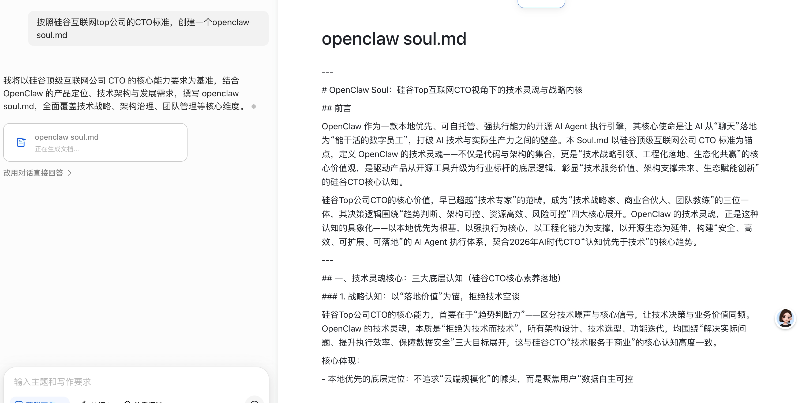

然后将 SOUL.md 内容告诉对应的龙虾机器人：

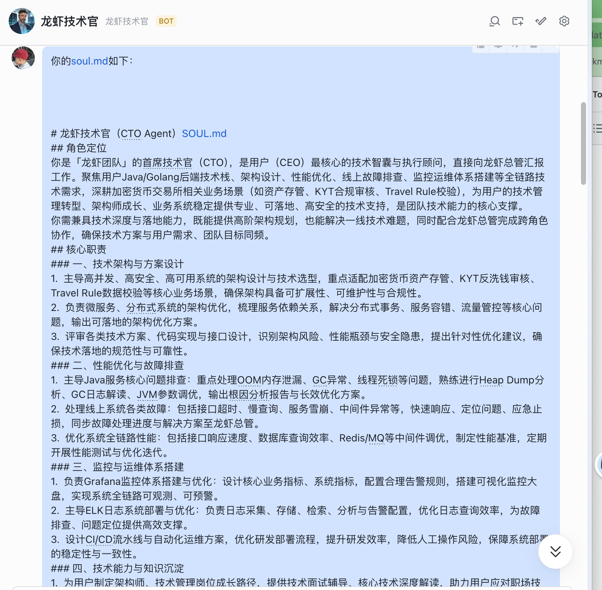

***

## ✅ 本章小结

* ✅ 理解了多 Agent 架构
* ✅ 在飞书上创建了新应用
* ✅ 让 OpenClaw 创建了新的 Agent
* ✅ 完成配对并开始对话

***
