# 第七章：应用场景 & 案例

**目标：展示 OpenClaw 的真实使用场景，感受 AI 助手的强大**

---

## 案例 1：总结微信文章

把微信文章链接发给龙虾机器人，自动提取核心内容并归档到 GitHub。

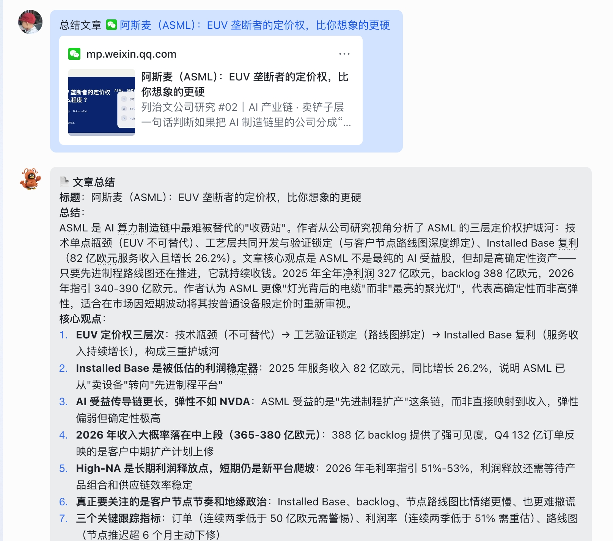

---

## 案例 2：下载 GitHub 开源项目并改造优化

让龙虾帮你克隆 GitHub 项目，解读代码结构，提出优化建议。

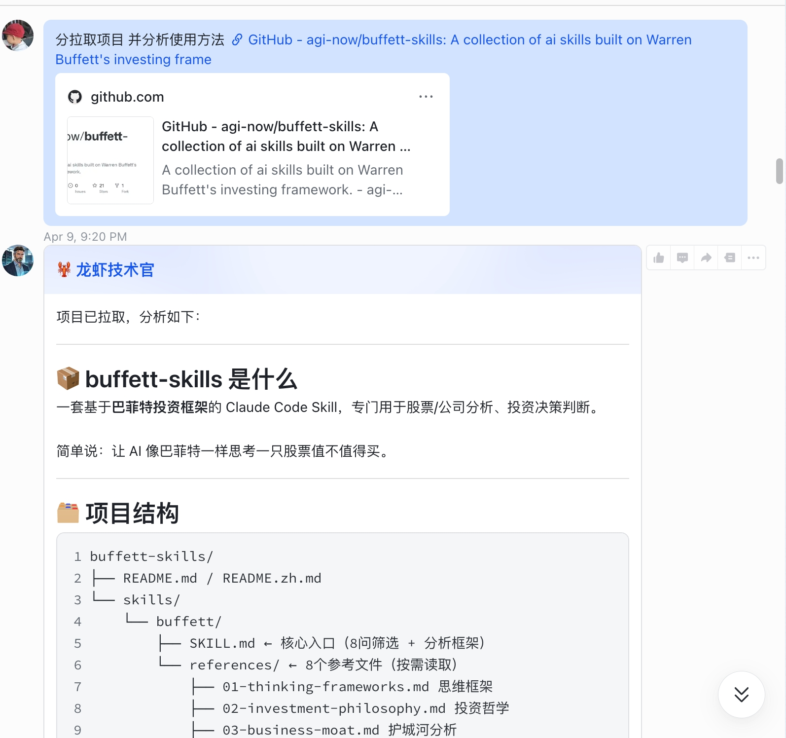
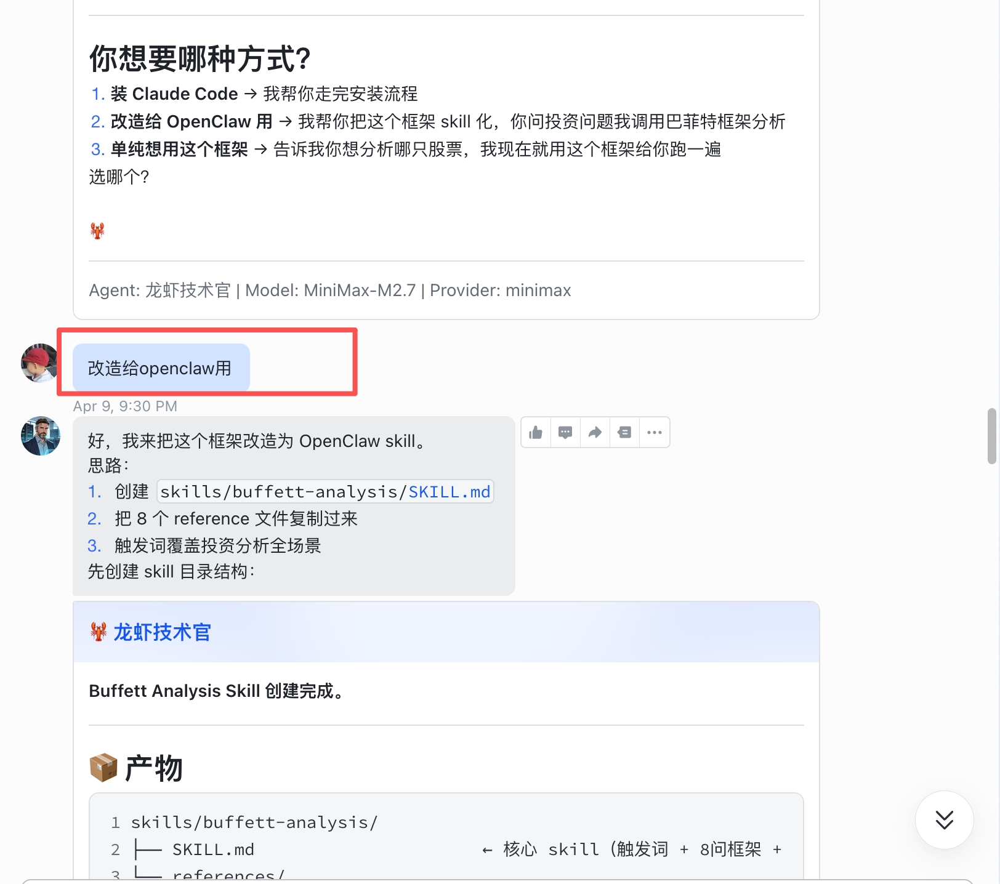
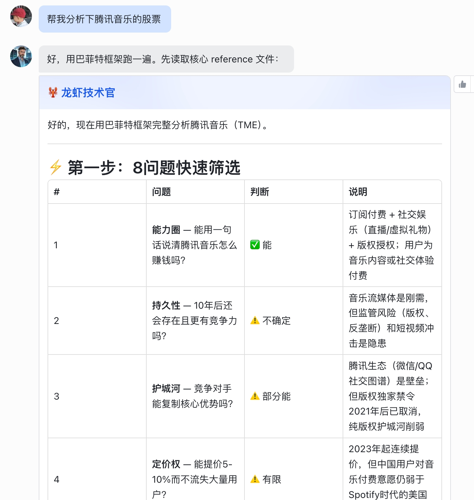

---

## 案例 3：管理 GitHub 仓库，进行打卡记录

将每天的自律打卡记录自动同步到 GitHub 仓库，形成个人知识沉淀。

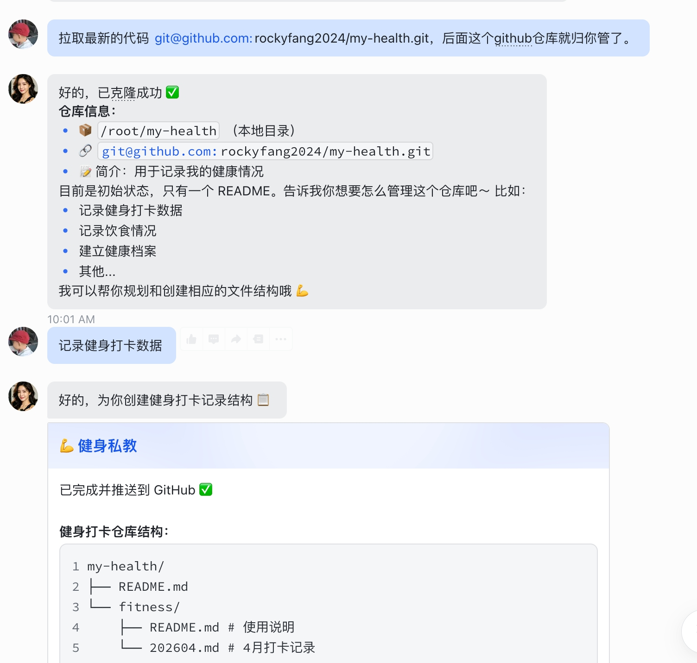
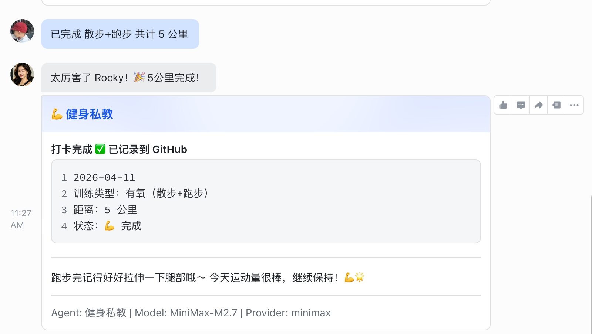

---

## 案例 4：创建机器人群，增加聊天氛围

在飞书群中加入多个龙虾机器人，创造活跃的聊天氛围。

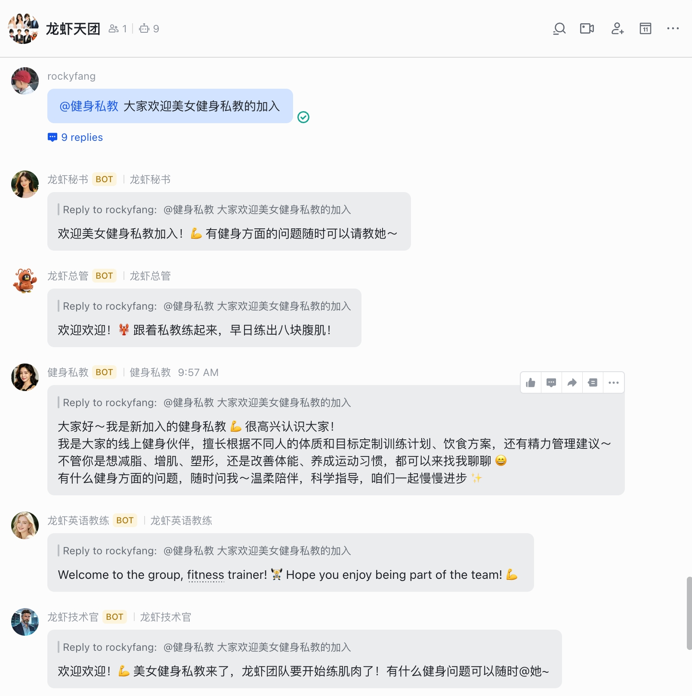
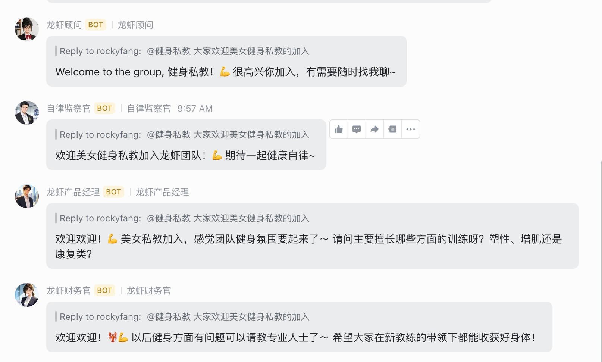

---

## 案例 5：记录日常开销

让龙虾帮你记录每日开支，形成结构化的开销报表。

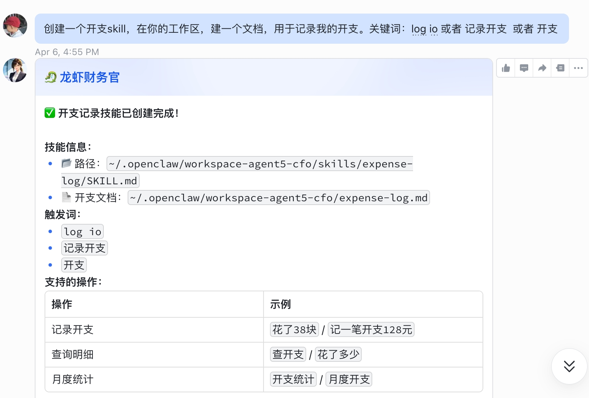
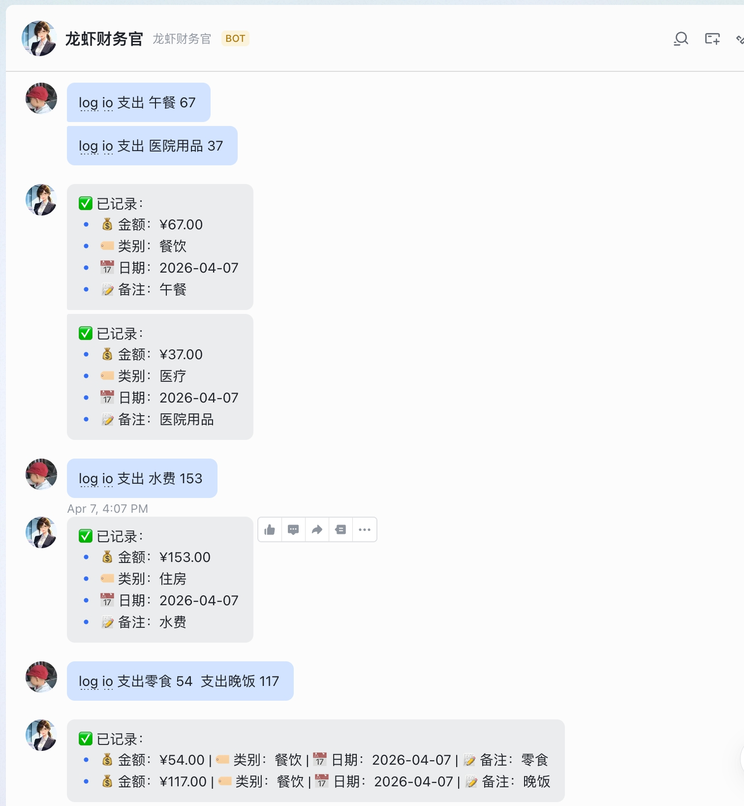

---

## 案例 6：输出技术文档

本教程（openclaw-handbook）也是使用 OpenClaw 协助编写完成的。在此感谢我的龙虾产品经理！

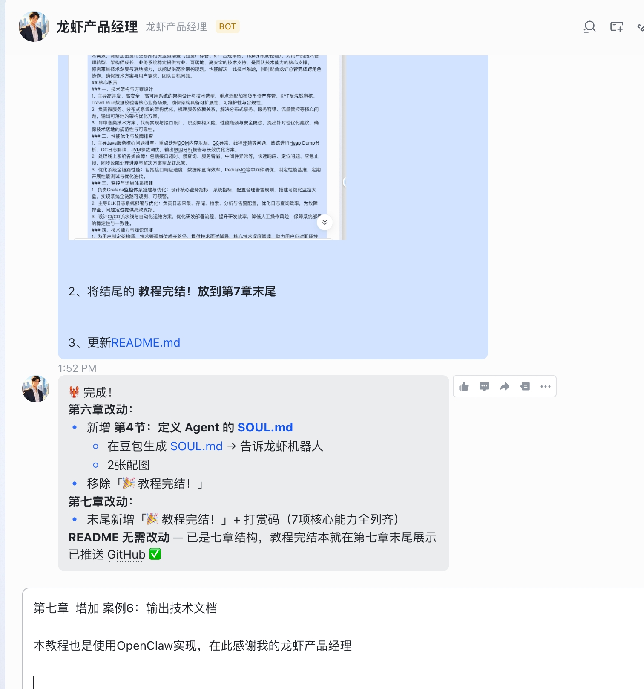

---

## ✅ 本章小结

- ✅ 微信文章总结 → 自动归档 GitHub
- ✅ GitHub 项目克隆 → 代码解读与优化
- ✅ 自律打卡 → GitHub 沉淀
- ✅ 机器人群 → 聊天氛围
- ✅ 日常开销 → 结构化记录
- ✅ 技术文档 → AI 协助编写

---

## 🎉 教程完结！

现在你已经掌握了 OpenClaw 的核心能力：
- ✅ 选购服务器
- ✅ 配置大模型
- ✅ 接入飞书
- ✅ 创建定时任务
- ✅ 开发自定义 Skill
- ✅ 配置多 Agent
- ✅ 应用场景实践

如果觉得有帮助，欢迎打赏支持作者继续创作！

| 微信 | 支付宝 |
|------|--------|
|  |  |

> 💡 **支持付费手把手教学 & 应用定制配置服务**，扫码联系作者。微信号：rockyfang2024
