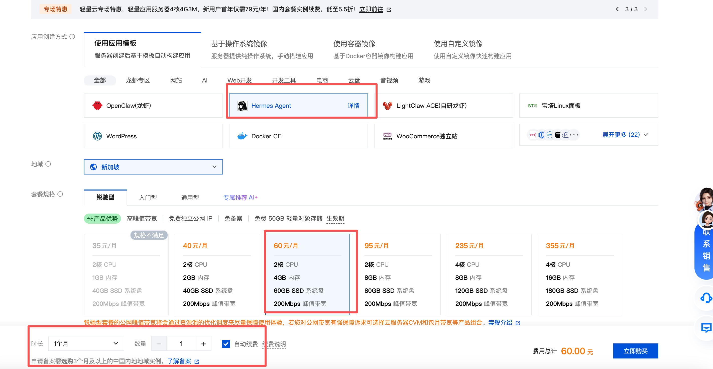
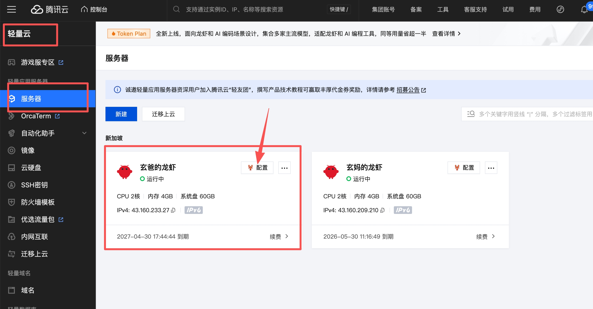
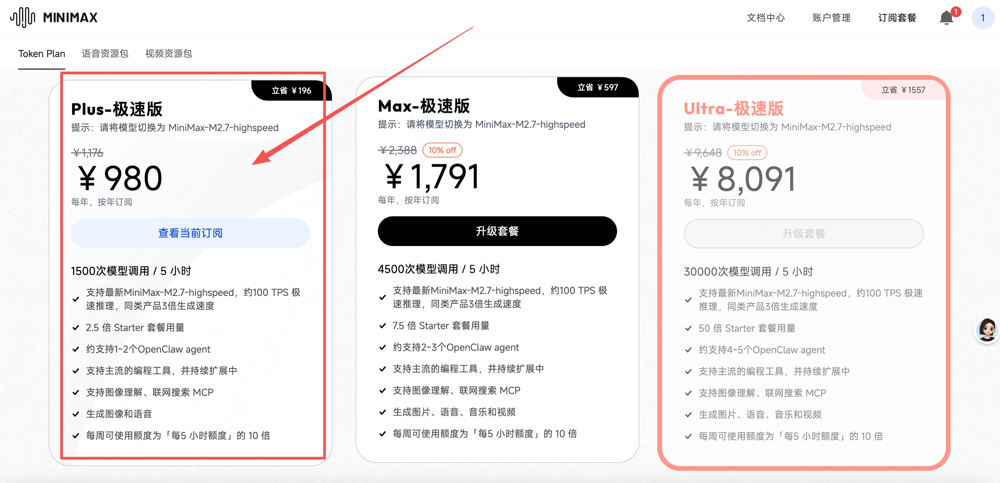

# Hermes 教程

> Hermes — 多 Agent 协作的 AI 助手矩阵系统。

***

## 📖 教程目录

### [第一章：选购腾讯云服务器](README-HERMES.md#第一章选购腾讯云服务器)

**目标：拥有自己的公网服务器，24小时运行 Hermes**

- 为什么需要云服务器
- 购买流程（腾讯云轻量应用服务器）
- 地域推荐新加坡，系统 Ubuntu 22.04 LTS

***

### [第二章：选购大模型](README-HERMES.md#第二章选购大模型)

**目标：获取 AI 模型 API Key，让 Agent 具备智能**

- 主流模型对比（MiniMax / DeepSeek / Claude / GPT-4）
- 注册 MiniMax（邀请码享 9 折优惠）
- 购买 Plus-极速版 Token Plan（量大管饱，无 token 焦虑）
- 配置 Hermes 使用模型
- 验证配置

***

### [第三章：接入飞书](README-HERMES.md#第三章接入飞书)

**目标：在飞书中与 Hermes Agent 对话，随时随地唤醒 AI**

- 在飞书开放平台创建应用
- 配置权限（事件订阅、长连接）
- 获取 AppID 和 App Secret
- 配置 .env 文件
- 配对连接

***

### [第四章：创建 Agent 实例](README-HERMES.md#第四章创建-agent-实例)

**目标：创建你的第一个 Hermes Agent**

- 目录结构说明（~/.hermes{N}/）
- config.yaml 核心配置
- SOUL.md 人设配置
- .env 环境变量
- 启动 Agent
- 配对与授权

***

### [第五章：多 Agent 协作](README-HERMES.md#第五章多-agent-协作)

**目标：搭建分工明确的 Agent 矩阵**

- Agent 分工设计示例
- SOUL 写作指南
- Agent 间隔离与协作

***

### [第六章：Skill 系统](README-HERMES.md#第六章skill-系统)

**目标：扩展 Agent 能力**

- Skill 是什么
- 内置 Skill（xthink、xfupan、xbook...）
- 自定义 Skill

***

### [第七章：定时任务](README-HERMES.md#第七章定时任务)

**目标：让 Agent 自动执行任务**

- Cron 配置
- 定时推送

***

---

# 第一章：选购腾讯云服务器

**目标：拥有自己的公网服务器，24小时运行 Hermes**

***

## 1. 为什么需要云服务器？

用自己的电脑跑 Hermes 可以，但需要：

* 电脑 24 小时开机
* 家庭宽带有公网 IP
* 断网 Bot 就离线

云服务器：**99.9% 在线、自带公网 IP、月租几十元**。

推荐配置：

* **地域**：新加坡（访问 GitHub 更流畅）
* **系统**：Ubuntu 22.04 LTS
* **规格**：2核2G
* **带宽**：5Mbps
* **存储**：50GB SSD

***

## 2. 购买流程

1. 打开 [腾讯云轻量应用服务器](https://cloud.tencent.com/product/lighthouse)
2. 选择配置（如上）
3. 设置登录密码（**记住！**）
4. 购买



付费完成后，可在控制台看到实例信息：



***

## ✅ 本章小结

* ✅ 购买了云服务器（新加坡节点）

***

## ➡️ 下一步

[第二章：选购大模型](README-HERMES.md#第二章选购大模型)

---

# 第二章：选购大模型

**目标：获取 AI 模型 API Key，让 Agent 具备智能**

***

## 1. 主流模型对比

| 模型           | 优势           | 劣势        | 推荐场景   |
| ------------ | ------------ | --------- | ------ |
| **MiniMax**  | 中文好、价格便宜、响应快 | 生态相对新     | ✅ 国内首选 |
| **DeepSeek** | 性价比高、开源      | 品牌认知度还在建立 | 追求性价比  |
| **Claude**   | 英文能力强        | 国内访问稍慢    | 英文场景   |
| **GPT-4**    | 通用能力强        | 成本高       | 预算充足   |

**推荐：MiniMax**（中文优化好 + 价格实惠 + Hermes 原生支持）

> 💡 **觉得 AI 助手很弱智？大概率是大模型没选对！**
> 免费模型（如 DeepSeek 免费版）能力有限，回复慢、内容浅。想要真正智能的体验，推荐使用 **MiniMax Plus/Max 付费套餐**，响应快、内容深、真正发挥 Hermes 的价值。

***

## 2. 注册 MiniMax（邀请码享 9 折优惠）

> 🎁 **MiniMax 跨年福利来袭！邀好友享 Token Plan 双重好礼，助力开发体验！** 好友立享 **9折** 专属优惠 + Builder 权益，你赢返利 + 社区特权！ 👉 立即参与：[https://platform.minimaxi.com/subscribe/token-plan](https://platform.minimaxi.com/subscribe/token-plan)

点击上方邀请链接 → 手机号注册 → 完成实名认证 → 享 9 折优惠！

***

## 3. 购买 Token Plan 服务

推荐购买 **Plus-极速版**，包年更划算（推荐包年）：



### Plus-极速版 套餐亮点

**🎯 量大管饱，无 token 焦虑！**

| 套餐           | 用量              | 价格                |
| ------------ | --------------- | ----------------- |
| **Plus-极速版** | 1500次模型调用 / 5小时 | ￥1,791/年（立省 ￥597） |
| **Max-极速版**  | 4500次模型调用 / 5小时 | 更大量               |

**Plus-极速版核心能力：**

* 1500次模型调用 / 5 小时
* 支持最新 MiniMax-M2.7-highspeed，约 100 TPS 极速推理
* 同类产品 3 倍生成速度
* 约支持 1~2 个 Hermes agent
* 支持图像理解、联网搜索 MCP
* 生成图像和语音
* **每周可使用额度为「每5小时额度」的 10 倍**（即每周最多 15000 次）

购买完成后，进入 **「我的账户」→「账户设置」** 获取你的 API Key。

***

## 4. 配置 Hermes 使用模型

编辑 `~/.hermes{N}/config.yaml`，配置模型：

```yaml
model:
  default: MiniMax-M2.7
  provider: minimax-cn
  base_url: https://api.minimaxi.com/anthropic
```

同时在 `~/.hermes{N}/.env` 中配置 API Key：

```bash
MINIMAX_CN_API_KEY=sk-xxxxxxxx
```

***

## 5. 验证配置

启动 Agent 后，在飞书对话框输入：

> 你现在用的是什么大模型

回复显示 **MiniMax M2.7**，说明配置成功！

***

## ✅ 本章小结

* ✅ 了解了主流模型
* ✅ 注册了 MiniMax（邀请码享 9 折）
* ✅ 购买了 Plus-极速版 Token Plan
* ✅ 获取了 API Key 并配置 Hermes

***

## ➡️ 下一步

[第三章：接入飞书](README-HERMES.md#第三章接入飞书)

---

## 🚀 快速上手

### 1. 创建 Agent 实例

```bash
mkdir -p ~/.hermes7/{bin,cache,cron,logs,memories,platforms,sessions,skills,sandboxes}
```

### 2. 配置 config.yaml

```yaml
model:
  default: MiniMax-M2.7
  provider: minimax-cn
  base_url: https://api.minimaxi.com/anthropic
```

### 3. 配置 .env

```bash
FEISHU_APP_ID=cli_xxxxxxxx
FEISHU_APP_SECRET=xxxxxxxx
MINIMAX_CN_API_KEY=sk-xxxxxxxx
```

### 4. 配置 SOUL.md

定义 Agent 的人设、行为规则、语言风格。

### 5. 启动

```bash
cd ~/.hermes7
HERMES_HOME=~/.hermes7 python -m hermes_cli.main gateway run
```

### 6. 配对

在飞书给 bot 发消息 → 获取配对码 → 运行：

```bash
hermes pairing approve feishu <CODE>
```

---

## 📁 目录结构说明

```
~/.hermes7/
├── config.yaml     # Agent 配置（模型、工具、行为）
├── .env            # 环境变量（飞书 AppID/Secret、API Key）
├── SOUL.md         # Agent 人设定义
├── bin/            # 启动脚本
├── cache/          # 缓存
├── cron/           # 定时任务
├── logs/           # 日志
├── memories/       # 记忆存储
├── platforms/      # 平台配置
├── sessions/       # 会话存储
├── skills/         # 能力扩展
└── sandboxes/      # 沙盒
```

---

## 🔗 相关资源

- [OpenClaw 教程](README-OPENCLAW.md)
- [Hermes GitHub](https://github.com/NousResearch/hermes-agent)
